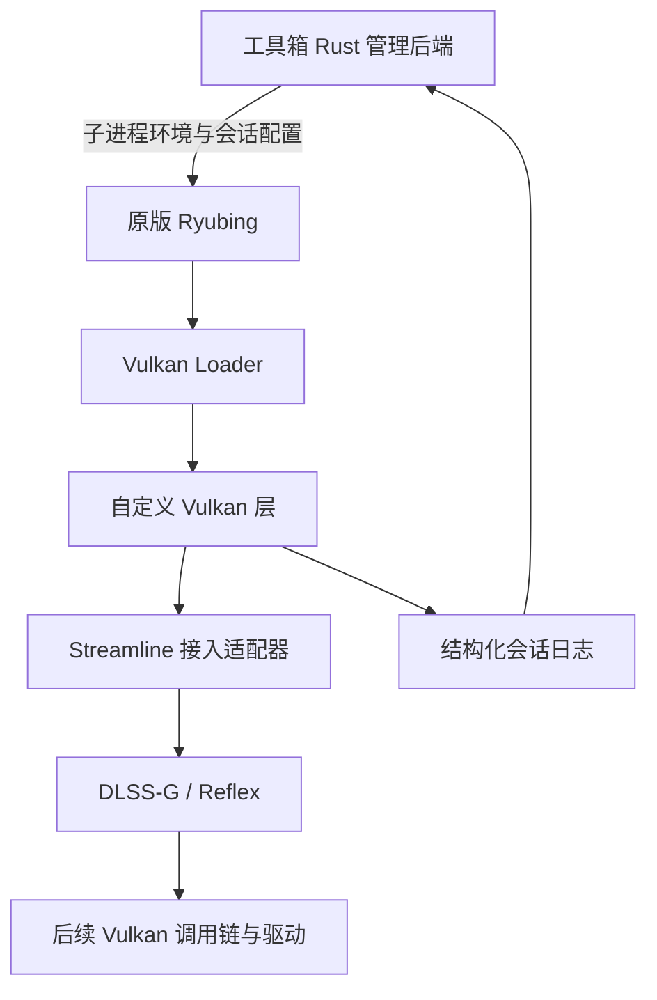

# 基于 Ryubing 分支的 Streamline Vulkan 插帧实现方案

日期：2026-09-25。

状态：待实施。本文只定义方案，不代表独立 Vulkan 层已验证可行。

依据：[Ryubing DLSS-G 分支实现调研](../ryubing-dlssg-implementation-research.md)。以该文记录的 `2026.911.47` 构建、EXE 哈希、反编译方法和日志为基线。AIO 已清理，不恢复其安装器、独立呈现窗口或运行时实现。

## 1. 目标与首版范围

在不修改选定原版 Ryubing 可执行文件的前提下，实现由工具箱按进程启用的 Vulkan 层，将主交换链接入 Streamline DLSS-G。生成帧由 Streamline 呈现链路处理，不自行创建 DirectComposition 输出窗口，也不通过连续多次调用原生 Present 模拟插帧。

首版范围：

- Windows x64、NVIDIA 支持 DLSS-G 的显卡；具体设备能力由 SDK 和驱动检测，不只匹配型号字符串。
- 固定一个原版 Ryubing 构建、Vulkan 后端、单个主交换链、SDR、窗口或无边框模式。
- 提供关闭和 2× 两种模式；先使用常量深度、零运动矢量、零 jitter、单位相机矩阵，无 HUD-less 资源。
- 初期关闭 ReShade、Feeder、NR、其他插帧和覆盖层，先验证独立插帧；这只是首轮验证边界，不要求用户永久卸载其他组件。
- 第一阶段不实现 DLSS SR、NR、3×/4×、HDR、跨 GPU、真实游戏深度识别或 HUD 分离。

参考分支已有 4× 模式，但首版以 2× 降低资源与同步复杂度。对照测试必须双方同倍率；后续多帧生成单独验收。

成功条件不是“SDK 初始化成功”或“计数翻倍”，而是画面产生有效中间帧、实际显示节奏改善，并通过停止游戏、窗口重建和退出验证。

## 2. 已知事实、设计决策与待证实项

| 分类 | 内容 |
| --- | --- |
| 已知 | 分支通过 Streamline 代理接管 Vulkan 交换链，存在 Reflex 调用和资源标签提交 |
| 已知 | 默认 FG 路径没有真实深度、游戏原生运动矢量、HUD 分离或真实相机数据 |
| 已知 | VORT 是可选屏幕空间估计，需要分别开启估计与向 FG 供给结果 |
| 决策 | 先复现上述默认输入契约，不把高级引导数据作为原型前置条件 |
| 决策 | 先实现独立运行时与诊断启动，再集成下载、安装和 UI |
| 待证实 | Streamline Vulkan 代理能否在独立 layer 中与 Loader 调用链正确组合 |
| 待证实 | 没有模拟器内部帧阶段信息时，frame token、Reflex 和资源有效期如何可靠对应 |
| 待证实 | 独立层能否在窗口操作前可靠停用 FG，并避免窗口线程与呈现线程互相等待 |
| 待证实 | 默认引导资源在本方案选择的运行库、尺寸与呈现模式下能否持续产生有效中间帧 |

分支成功不能直接证明独立 layer 成功。若独立接入无法成立，应明确输出阻断证据和“必须改模拟器”的边界，不重新包装 AIO 作为替代，也不默认启动模拟器 fork 开发。

## 3. 架构与代码边界



图中为逻辑责任关系，不是已经确定的函数转发拓扑。SDK 代理到下一层的实际调用路径必须在 P0/P1 证明，不能直接从图推导实现。

建议在 `src-tauri` 下新增独立 crate，而不是让注入模拟器的 DLL 链接整个 Tauri 应用：

```text
src-tauri/
  crates/streamline-vulkan-layer/       # Rust cdylib，独立 manifest/构建入口
    src/entry.rs                      # Loader 协商、导出入口与调用转发
    src/dispatch.rs                   # instance/device/queue 分发表
    src/device.rs                     # 能力、扩展、创建与销毁
    src/swapchain.rs                   # 交换链代理与状态机
    src/resources.rs                  # 每帧资源与生命周期
    src/sync.rs                       # 队列、信号量、fence 管理
    src/streamline.rs                  # 固定版本 SDK 适配边界
    src/telemetry.rs                   # 日志与状态
  examples/streamline_fg_probe.rs      # 诊断启动与测试入口
  src/services/graphics_components/streamline_fg/
                                      # 后期安装、检测、启动、卸载
```

这是建议布局，不是对现有文件位置的描述。独立 crate 初期不加入应用默认构建成员；明确各自的格式化和检查命令。

Rust 层负责 Vulkan ABI、状态机和资源管理。Streamline 的 ABI 必须以固定版本头文件为准：不得直接把反编译出的 C# 结构体布局当成稳定 Rust FFI。若 SDK 的 C++ 接口需要桥接，P0 明确最小 C ABI shim 的范围、构建方式及必要性；不在本阶段擅自扩展为一整套 C++ 运行时。

现有 `graphics_components/vulkan.rs` 管理的是共享 ReShade 注册与文件事务。新方案可以复用已验证的文件校验或计划思想，但不复用其全局注册作用域，也不把新 DLL 注册进既有 ReShade 安装记录。

## 4. P0：补齐分支调用链与 SDK 契约

先完成定向静态审查，交付可复核的接入清单：

1. 提取并分析 `Streamline`、`VulkanRenderer` 及设备创建辅助类型，追踪 `slInit`、功能列表、偏好标志、Vulkan 设备注册和代理获取顺序。
2. 核实分支实际启用的实例扩展、设备扩展、特性链和队列配置及失败重试。按固定 SDK 的 `slGetFeatureRequirements` 逐项记录各启用功能的需求，包括额外 graphics / compute 队列数量、索引及可选 native optical flow 路径的要求；明确这些需求在实例 / 设备创建前如何满足。更新日志提到的 `VK_NVX_binary_import`、`VK_NVX_image_view_handle`、`VK_EXT_private_data` 只是核查线索，不视为跨版本完整需求清单。
3. 冻结 Streamline 插件、DLSS-G、Reflex 及相关运行库的版本和哈希；校验对应头文件、状态字段语义、调用约定与结构体布局。
4. 为每个接管接口画出“应用 → 本层 → SDK → 下一层”的调用路径，识别 SDK 是否重新进入 Loader、是否需要宿主直接提供函数、如何避免递归与对象混用。
5. 追踪 swapchain resize、游戏停止、第二次启动、设备销毁和 `slShutdown`；区分进程全局 SDK 状态与每设备、每交换链状态。
6. 标记模拟器内部可见而外部层不可见的信息，例如真实逻辑帧阶段、缩放前的颜色图和精确裁剪信息，并给出首版约束或替代办法。
7. 核对固定 SDK 对窗口操作前停用 FG 的要求，明确独立层如何取得前置通知、由哪个线程调用停用接口及如何确认完成。核查 `vkCreateWin32SurfaceKHR` / `vkDestroySurfaceKHR` 的 SDK 代理要求及 HWND 关联；不能把 surface 创建 / 销毁钩子本身当作已具备 resize 前置通知。若依赖 SDK 窗口钩子或额外 Win32 通知，记录其覆盖的窗口操作、线程约束、注销时机和等待关系。

**通过条件：** 固定版本的 ABI 清单、实例 / 设备创建前的需求清单、队列分配表、初始化顺序、函数转发拓扑和资源所有权表明确；窗口前置通知与停用路径有可实现的设计和依据，列出 P2/P3 必须验证的事件时序，没有依赖“SDK 应该会处理”的关键空白。

**停止条件：** SDK 代理无法在合法的层链中接入、只能依赖无法稳定获得的私有宿主信息，或无法给出满足固定 SDK 窗口停用时序的路径。此时记录证据与替代边界，不进入工具箱 UI 开发。

## 5. P1：按进程加载与透明转发

### 加载范围

由诊断启动器配置子进程环境，加载专用 layer manifest；具体环境变量组合按目标 Vulkan Loader 版本核验。不得假设 `VK_LAYER_PATH` 会覆盖所有隐式层，也不得通过清空用户环境掩盖冲突。

- 使用绝对路径和独立会话目录。
- 层内核对目标程序身份及会话配置，不对未知进程启用 FG。
- 不写全局 Vulkan 注册表，不替换系统 `vulkan-1.dll`，不修改参考分支目录。
- 启动前检测其他插帧或重叠图形层；首版发现不支持组合时报告原因，不擅自移除用户组件。

### 转发契约

实现 Loader 接口协商、`vkGetInstanceProcAddr`、`vkGetDeviceProcAddr` 以及实例和设备生命周期管理。按 instance/device 保存下一层函数表；处理层链创建信息，不能修改应用持有的数据结构或遗留临时指针。

首轮不加载 Streamline，仅确认透明转发不改变应用输出与返回值。随后增加设备、队列、surface、交换链和呈现事件的只读诊断。对被支持应用实际使用的入口变体逐一核查，例如 `vkGetDeviceQueue2`、`vkAcquireNextImage2KHR`；不能只实现调研中的六个名称就假定覆盖完整。

**通过条件：** 原版 Ryubing 可正常启动、运行、调整窗口并退出；同一进程能停止并重新启动游戏；没有本层引入的 Vulkan 验证错误。

## 6. P2：Streamline 初始化与代理交换链，FG 保持关闭

### 实例、设备与队列初始化

按 P0 固定的顺序初始化 SDK、声明功能、查询支持并注册 Vulkan 信息。手动接入时，先在实例 / 设备创建前核验并落实需求，创建成功后再注册实际 Vulkan 信息；若由 SDK 创建代理负责补齐需求，也必须证明其与 Loader 链兼容，并记录实际创建结果：

- 对每个启用功能调用 `slGetFeatureRequirements`，保存实例扩展、设备扩展、特性及额外队列需求；不能等实例 / 设备创建后再补查并假设仍能添加。
- 查询实例扩展及设备能力，构造独立的创建参数和 `pNext` 链，保留应用原有需求及有效的 Loader 链信息；不得虚报支持。
- 按队列族容量合并应用与 SDK 的队列需求，保留应用原有队列索引、优先级及创建标志，为 SDK 分配所需的额外队列。核验同族 graphics / compute 需求的合并规则，不把同一个队列未经证明地重复分配给应用与 SDK。
- 将实际创建的队列族、SDK 队列起始索引及固定版本要求的其他字段传给 `slSetVulkanInfo`，日志保留应用 / SDK 队列分配表。是否启用 native optical flow 由 P0 冻结；所需独立队列族与特性未满足时，只能使用已验证的 interop 路径或保持 FG 关闭。
- 所需扩展、特性或队列容量不足时，在产生代理对象前保持透明转发并记录具体缺项；不能返回未创建的队列句柄或在设备创建后补建队列。

若附加配置导致实例或设备创建失败，只有在确认没有残留 SDK 对象和资源后，才允许使用对应的原始参数及有效 Loader 链信息重试并保持 FG 关闭。日志同时记录原始与重试结果。已经返回给应用的实例 / 设备不得由本层私自替换。

### 交换链

让创建、图像枚举、获取、呈现、销毁及必要的等待调用沿同一代理路径运行。不能让代理创建的对象在错误路径上由原生入口销毁。

按 P0 清单处理 surface 的 SDK 代理与 HWND 关联，不能只代理交换链入口。FG 保持关闭时记录窗口前置通知、窗口操作、交换链重建和呈现调用的时间与线程，核查通知覆盖范围及线程等待关系；此阶段的记录不能代替 P3 开启 FG 后的停用时序验证。

- 记录 surface、设备、队列族、格式、尺寸、图像数、用法标志和呈现模式。
- 选择支持的呈现模式；参考分支优先 Immediate，首版若前提不满足则明确拒绝启用 FG，不静默声称等效支持。
- 如需增加图像 usage，先检查 surface 能力；不直接 OR 一个未支持的标志。
- 首版只支持明确选定的主交换链和兼容的 graphics/present 队列关系。多交换链或独立队列族未验证时，保持关闭或要求重启到透明转发模式。

**通过条件：** 实例 / 设备需求和实际队列分配一致，缺项与容量不足的回退可验证；SDK 初始化、代理创建与关闭路径可重复执行；即使 FG 关闭也能稳定显示、重建和退出，且没有重复代理、递归调用或资源泄漏证据。窗口前置通知能覆盖首版允许的操作，线程时序符合 P0 设计。

## 7. P3：2× 插帧输入、资源与同步

### 默认输入契约

| 输入 | 首版设计 |
| --- | --- |
| 颜色 | 以 SDK 固定版本规定的交换链输入为准；核验是否需要额外颜色标签或副本 |
| 深度 | 自建常量纹理，按参考 FG 路径取 0，不误用 NR 的 0.5 |
| 运动矢量 | 自建全零纹理，明确记录为零矢量模式 |
| 相机与 jitter | 按已核对的分支契约使用合成参数，并显式标记非游戏原生数据 |
| HUD-less | 缺省，不把含 HUD 的颜色图冒充无 HUD 图 |
| frame token | 每个被本层接管的应用帧唯一关联，不给生成帧递归创建新应用帧 |
| 倍率 | 先请求一张额外帧；以固定 SDK 的实际参数语义设置 |

引导图像格式、尺寸、布局、缩放因子与常量必须成套核对。独立层看不到分支的缩放前源画面，首版优先在输出分辨率下建立自洽契约；与参考分支输入分辨率的差异须记录，不能声称逐项相同。

### 启用与恢复条件

首次启用、每次交换链重建及暂停恢复时，按固定 SDK 允许的时机查询 `slDLSSGGetState`，核验 `minWidthOrHeight`、状态及请求倍率是否支持，同时重新检查格式、呈现模式和队列关系。字段所属结构体及有效时机以固定版本头文件为准，不沿用旧 generation 的查询结果。

- 输出宽、高都必须满足 SDK 返回的最小尺寸。非零但任一边低于阈值时，保持 `eOff` / `Suspended`，不建立或启用 FG 专用输入资源；日志和状态记录当前尺寸、阈值及暂停原因。
- 必要查询失败、返回值尚不可用或出现 SDK 错误状态时，保持关闭或停用 FG 并诊断，不用硬编码尺寸或上一次成功状态代替检查，也不把预热状态误报为 `Active`。
- 尺寸稳定并重新满足全部条件后，按资源退休约定清理旧标签、重置历史，进入预热；确认 SDK 状态正常及实际生成后才能进入 `Active`。

### 资源有效期

以交换链 generation 和帧槽管理资源，每槽关联 command buffer、同步对象、资源标签和完成条件。CPU 的 Present 返回或某个 SDK 调用成功，不代表 SDK 已结束读取资源。

必须依据固定 SDK 的生命周期约定和可观察的 GPU 完成信号，证明引导图像与颜色资源可复用、释放。未证明之前，不接受用“多留几帧”代替同步。

### 呈现等待链

若层在 Present 前增加 GPU 工作，设计必须保证应用提交的二进制信号量只被合法消费一次。例如，层的提交消费应用等待信号量，再用新的完成信号量连接后续代理呈现；不能让层提交和代理 Present 各自等待同一份二进制信号。

这不是强制每帧都增加提交：具体是否需要、SDK 是否自行处理，应由资源操作决定。还需保持 `VkPresentInfoKHR` 中的 `pNext`、每交换链结果及错误语义，不因重建参数丢失应用信息。

首版不支持的跨队列所有权转换和多交换链 Present 必须被识别。发生超时或 device lost 后不能假定 GPU 已完成并继续释放、复用资源。

### Reflex

参考分支有 `BeforePresent`、`AfterPresent` 和 `slReflexSleep`，但外部层无法准确观察游戏的 SimulationStart 等逻辑阶段。P0/P3 必须明确哪些标记能真实提供，哪些只能使用呈现边界近似，并验证 SDK 接受这种接入。

不将参考分支的调用位置自动等同于最佳低延迟实现。若无法满足必要契约，应作为路线阻断项记录；不能通过伪造逻辑帧阶段完成验收。

## 8. 生命周期、回退与状态机

建议状态：`PassThrough → SdkReady → ProxyReady → WarmingUp → Active`，另设 `Suspended`、`Faulted`、`Stopping`。安装状态与运行状态分开。

### 窗口事件时序

窗口操作的处理必须落实为可验证的事件路径：前置通知 → 按 SDK 线程约定提交 `eOff` 并确认必要的停用完成条件 → 窗口操作 / 交换链重建 → 重新核验启用条件 → 预热。P0 确定通知与执行机制；P3 开启 FG 后记录时间戳、线程、generation、停用结果及必要完成信号，证明首版允许的 resize、最大化、最小化 / 恢复及窗口模式切换满足固定 SDK 的时序。

仅观察到 `VK_ERROR_OUT_OF_DATE_KHR`、`VK_SUBOPTIMAL_KHR` 或新交换链尺寸，不足以证明已在窗口操作前停用。不得让窗口线程同步等待持有窗口相关锁的呈现线程，也不得在窗口回调中持有全局状态锁进行 SDK 调用或 GPU 等待。无法可靠获得前置通知或无法证明无等待环时，作为路线阻断项处理，保持 FG 关闭；不能以偶尔通过重建测试代替时序依据。

| 事件 | 处理原则 |
| --- | --- |
| 尺寸 / 格式变化 | 窗口操作遵循上述前置停用时序；完成旧资源退休，建立新 generation，重新核验尺寸阈值和 SDK 状态后预热 |
| 最小化或零尺寸 | 最小化前停用 FG，暂停建立 FG 资源；恢复后重新核验，不能仅凭尺寸非零启用 |
| 非零但低于 SDK 最小尺寸 | 保持 FG 关闭并记录阈值；恢复至合格尺寸且其他条件通过后重置历史并预热 |
| SDK 错误状态 / 必要状态查询失败 | 保持关闭或停用 FG，记录错误与观测时间；完成重新核验前不进入 Active |
| 正常关闭 FG | 保留已有代理交换链，以 SDK 支持方式停止生成；不能突然切到原生对象路径 |
| SDK 初始不可用 | 在代理对象产生前退回透明转发，报告原因 |
| 代理运行中故障 | 尽可能停用 FG并正确重建；无法证明安全时标为故障并要求重启，不承诺无缝回退 |
| 持续 x1 | 显示未生成额外帧，保存诊断；自动重启功能放在生命周期验证之后 |
| 停止游戏 / 第二次启动 | 释放该设备会话，按 SDK 的进程级约束重新建立，避免复用已销毁的句柄 |
| 退出 | 在 Vulkan 设备仍有效时完成需要的 SDK 与资源清理，不把重型清理放在 DLL detach |

并发采用明确的状态锁和资源所有权；不得持有全局映射锁调用可能重入本层的 SDK / 下一层入口。销毁与异步回调交叉情况纳入生命周期测试。

## 9. P4：验证方法与验收门槛

### 对照组合

在同一 GPU、驱动、显示器、游戏版本、场景、基础帧率和输出尺寸下对照：

1. 原版 Ryubing，不加载本层。
2. 原版 Ryubing，本层透明转发。
3. 原版 Ryubing，Streamline 代理但 FG 关闭。
4. 原版 Ryubing，本层 2× FG。
5. 用户提供的参考分支，设为 2×，记录其 SR / NR 设置差异。

使用固定平移镜头、移动物体、遮挡变化和 HUD 场景。必须记录参考分支是否启用 VORT，不能混用 4× 结果推断本原型 2× 效果。

### 三层证据

- **SDK 层：** 调用成功、状态、请求倍率、实际呈现字段及其已核对语义。
- **系统呈现层：** 可用的 ETW / PresentMon 等工具记录应用和显示相关时间；先确认能否覆盖 SDK 生成帧，不完整时只能作辅助证据。
- **画面层：** 高帧率屏摄或经验证能捕获实际输出的设备，逐帧确认不同中间画面及其显示间隔。普通应用截图不能代替最终显示测量。

### 输入延迟对照

对上述五组分别测量可重复输入到屏幕可见响应的端到端延迟。固定输入设备、游戏内响应、屏幕观测区域和帧率限制策略，记录 VSync / VRR / Reflex 设置；采用可同时记录输入触发与屏幕变化的高速摄影或经校验的延迟测量设备。单纯的 Present 耗时、SDK 标记或 FPS 不作为端到端延迟证据。

每组至少三批、每批 100 次有效触发，交错安排对照顺序，保留原始样本、测量分辨率、误差估计和排除规则，报告中位数、P95 及相对无层基线、代理关闭组和参考分支的差值。以无层基线的稳定应用帧率定义一帧时间 `T_base = 1000 / FPS_base` 毫秒；本项目初始容许增量为一帧，测试前冻结，不能在看到结果后放宽。

### 初始验收标准

以下是本项目拟定门槛，不是 NVIDIA 保证，开始测试前冻结测试环境和统计方法：

- 连续运行 10 分钟的固定运动场景，确认存在有效中间帧，排除纯重复帧或仅计数翻倍。
- 对至少三个稳定的 60 秒片段：当基础帧率稳定且显示刷新率足够时，有效独立显示帧率达到基线的至少 1.8 倍；排除加载、菜单和场景切换，并保留原始样本与排除规则。
- 帧间隔分布不持续呈现“两帧紧挨、随后长空档”的模式；报告中位数、P95、P99及成对间隔，不能只报均值。
- 本层 2× FG 相对无层基线的端到端输入延迟，中位数和 P95 的增量均不超过 `T_base`；边界结果需结合测量误差判定，无法分辨时保持未验收。该门槛是项目取舍，不代表 SDK 保证；有效显示帧率达标不能抵消延迟超标。
- 至少 30 分钟实际游戏，无桌面闪入、持续黑屏、GPU 挂起或本层引入的崩溃；伪影单独记录，与参考分支同场景比较。
- 连续完成 20 次窗口尺寸 / 最小化恢复循环及 20 次同进程停止并重新启动游戏；记录退出码及资源数，确认无持续增长。
- 窗口循环覆盖普通拖动缩放、最大化、最小化 / 恢复及首版允许的窗口模式切换，保留前置通知与停用完成的事件轨迹，检查窗口线程与呈现线程无等待环。
- 单独完成 20 次“合格尺寸 → 非零但至少一边低于 SDK 最小尺寸 → 合格尺寸”的循环，覆盖阈值边界；低于阈值期间无 FG 激活，恢复须经过重新查询、历史重置和预热。若目标窗口最小尺寸阻止触达该边界，使用同一层的最小 Vulkan 测试宿主补测，并记录与目标应用的差异；必要状态查询失败和错误状态另用故障注入验证保持关闭的路径。
- 本层引入的 Vulkan 验证错误为零。性能测量时关闭会显著干扰性能的验证层，验证运行与性能运行分开保存。

若只获得 SDK / CPU 计数而无有效显示证据，状态保持“功能已接入，显示效果未验收”。

若缺少有效的端到端延迟测量或延迟超标，P4 保持未通过，不进入 P5 产品集成。

## 10. P5：工具箱集成与部署

仅在 P4 通过后新增安装、检测、配置与启动管理。后端提议接口包括：`detect_streamline_fg`、`prepare_streamline_fg_install`、`install_streamline_fg`、`launch_streamline_fg`、`uninstall_streamline_fg`、`get_streamline_fg_status`；先固定数据契约，再实现 UI。

安装包包含本层、manifest、固定版本依赖清单和必要声明。运行库采用可核实来源，记录哈希与适用分发条件；反编译仅用于理解行为，不直接将提取的程序集作为产品交付。

安装使用独立、版本化目录与可恢复文件事务；校验目标与预检快照，避免覆盖不属于本组件的文件。每次启动创建独立会话日志。卸载只清理拥有的文件，不触碰游戏配置、存档、全局 Vulkan 注册或其他图形组件。

状态至少区分：已安装、未加载、SDK 不支持、FG 关闭、预热、正在生成、x1 回退、暂停、故障。另行展示请求倍率、SDK 报告倍率及观测时间；状态过期后清空，避免沿用曾经成功的倍率。

初版 UI 只需开关、2×、专用启动和诊断导出。ReShade / Feeder 共存属于后续阶段：先验证层顺序、颜色处理位置、生成帧是否被重复处理以及退出路径，再开放组合使用。

## 11. P6：可选运动估计及扩展

只有默认零矢量路径已通过验收后，才增加 VORT 或其他运动估计。保留“估计启用”与“向 FG 供给”两个可独立诊断的开关，检查当前 / 前一帧对应关系、方向、单位、缩放、裁剪与历史重置。

先用已知运动的合成序列验证矢量，再做同场景零矢量对照。若收益不足或导致帧调度退化，默认保持关闭。复用第三方着色器前确认其许可与项目分发方式相容，不把公开可读等同于可任意复制。

3×/4×、多交换链、其他模拟器、SR / NR、真实引导数据和 HUD 分离均另列验收项，不能因 2× 原型通过自动宣布支持。

## 12. 交付阶段与检查要求

| 阶段 | 交付物 | 是否允许进入下一阶段 |
| --- | --- | --- |
| P0 | SDK / 分支调用契约、创建需求与队列分配表、窗口停用时序、移植边界、转发拓扑 | 关键接入点及窗口前置通知路径可实现且有依据 |
| P1 | 透明转发层、诊断启动器、基础日志 | 不改变基线功能与生命周期 |
| P2 | FG 关闭的代理交换链、创建需求与队列核验、窗口事件轨迹 | 缺项可回退，初始化、重建与退出可重复，前置通知覆盖允许操作 |
| P3 | 固定范围 2× 原型 | 输入、资源退休、同步及窗口停用时序成立，尺寸 / 状态启用条件有效 |
| P4 | 对照数据、有效显示帧证据、端到端延迟数据、生命周期报告 | 显示、延迟及生命周期均达到验收标准 |
| P5 | 工具箱后端、安装包及最小 UI | 安装恢复与状态准确性通过 |
| P6 | 可选运动估计和扩展能力 | 各项独立验证后开放 |

Rust 改动后执行相应 manifest 的 `cargo fmt`、宿主 `cargo check` 和显式 Windows 目标检查，修复错误与警告；新增独立 crate 也须覆盖。应用在其他宿主上的管理模块应返回明确不支持，避免直接链接 Windows 运行时。涉及 macOS 验证时遵循仓库要求使用 `cargo zigbuild`。

测试优先覆盖真实风险：分发表和重入、实例 / 设备创建失败清理、队列容量与索引分配、窗口事件与线程等待关系、最小尺寸边界及 SDK 查询失败、状态迁移、资源退休、信号量消费、ABI 断言、安装中断恢复。GPU 集成、屏幕效果与端到端延迟不能由单元测试替代。前端在 P5 修改后执行类型检查及必要构建。

本次文档任务不创建上述代码或运行时，不修改模拟器，也不开始安装或 GPU 实验。

## 参考

- [分支实现调研与证据索引](../ryubing-dlssg-implementation-research.md)
- [Streamline 2.12.0 手动接入：实例、设备与队列需求](https://github.com/NVIDIA-RTX/Streamline/blob/v2.12.0/docs/ProgrammingGuideManualHooking.md#521-instance-and-device-additions)
- [Streamline 2.12.0 DLSS-G 接入：窗口停用、尺寸与状态检查](https://github.com/NVIDIA-RTX/Streamline/blob/v2.12.0/docs/ProgrammingGuideDLSS_G.md#170-dlss-g-integration-checklist-details)
- [Vulkan Loader 层接口](https://github.com/KhronosGroup/Vulkan-Loader/blob/main/docs/LoaderLayerInterface.md)

本次审核读取到参考目录中 `sl.interposer.dll`、`sl.common.dll`、`sl.dlss_g.dll` 与 `sl.reflex.dll` 的文件版本标注为 `2.12.0.0`，因此以上 SDK 链接固定到 `v2.12.0`。文件版本标注不替代二进制哈希与 ABI 核对；P0 仍须冻结实际采用的运行库、头文件和 Loader 版本，若改用其他 SDK 版本须重新核验上述契约，不以不断变化的 main 文档替代版本化依据。
